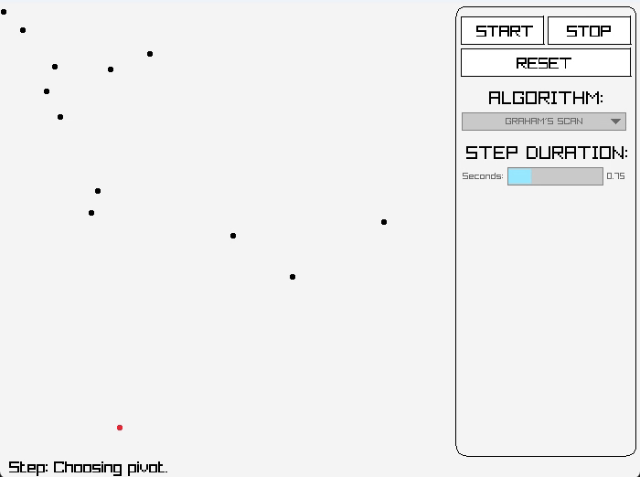

# Hullifier

<p align="center">    
    
</p>

<p align="center">
    Visualizes convex hull algorithms.
</p>


## Building

Hullifier is currently setup to run on windows. Building is as simple as:

```bash
$ git submodule init
$ git submodule update
$ ./build.ps1
```

After building you should have an executable named `hullifier`. Currently `hullifier` only supports building on Windows.

## Usage

Hullifier takes in an input file that contains positions of points given in format (x,y) that will be then used as the input for generating the convex hull that contains all given points. Note that points should have their coordinates be defined within range [0,500] as points outside this range will be discarded.

You can use the examples provided with the package or provide your own point set. Afterwards run the following command:

```bash
$ ./hullifier <input_file>
```

The data folder contains an exemplary input file that can be used to test the functionality.

```bash
$ ./hullifier data/input.txt
```

### Implemented algorithms:

Currently `hullifier` visualizes the following algorithms:

 - Graham Scan
 - Jarvis March
 - Quickhull

### Keyboard Shortcuts

Once you have a `hullifier` running, you can give `hullifier` instructions with the keyboard as follow:

 - `space`: starts the algorithms running sequence.
 - `left arrow`: goes backwards one step within the algorithms run sequence.
 - `right arrow`: goes forwards one step within the algorithms run sequence.
 - `f`: jumps to the finished state.
 - `r`: restarts the algorithms run sequence.

## License

This repository is licensed under the MIT license.